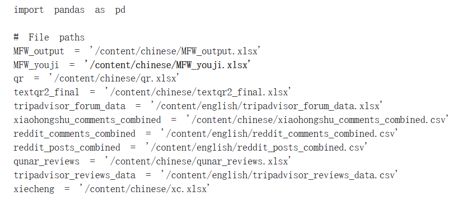

# Topic_Modelling
旅游目的地形象是游客对特定目的地的感知、印象和感受的综合反映。独特的目的地形象能够塑造旅游品牌，有利于促进当地旅游产业的发展。本研究运用BERTopic机器学习模型分析用户生成内容(UGC)，探索澳门作为旅游目的地的多维形象。通过分析多个社交媒体平台上超过59,000条旅游评论，本研究识别出定义游客对澳门感知的关键主题。分析揭示：(1)中国游客和国际游客的关注重点存在差异，凸显了文化和娱乐偏好的不同，形成了关于国内外游客对澳门目的地形象认知的五个主题；(2)不同维度的关键词呈现出多种共现关系。本研究通过数据驱动和跨文化视角，有助于理解旅游目的地形象，并为澳门可持续旅游管理提供可操作的见解。此外，本研究强调了媒体和社会建构在塑造游客视角中的作用，并基于这些发现为旅游营销提供了建议。本github项目提供了该研究用到的代码、数据集和相关模型的详细介绍。

The image of a tourist destination is a comprehensive reflection of tourists' perceptions, impressions, feelings, and emotions towards a specific destination. A unique destination image can shape a tourism brand and promote the development of local tourism industry. This study uses BERTopic machine learning to construct a model to analyze user generated content (UGC) and explore the multidimensional image of Macau as a tourist destination. By analyzing over 59000 travel reviews from domestic and foreign tourists; Through multiple social media platforms, this study identified key themes that define tourists' perceptions of Macau. The analysis reveals that: (1) Chinese tourists have different focuses compared to international tourists, highlighting cultural and entertainment preferences. As a result, five themes about the destination image of Macau are derived, which are used to (2) display various co-occurrence relationships among keywords from different dimensions. This study aims to understand the tourist perspective of tourist destinations through data-driven and cross-cultural perspectives, and provide recommendations for tourism marketing based on these findings. And provided actionable insights for sustainable tourism management in Macau. In addition, this study also emphasizes the role of media and social construction in shaping keywords and these findings. This Github repository provides the code, dataset and an introduction to the main model utilized in this study.

